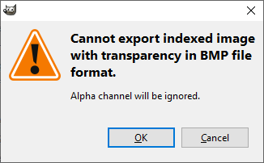

# Gimp Animation Tutorial

1. Crop and/or resize the desired animation to 64 x 128 px. Scaling all layers can be done with `Scale Image`.

2. Set the animation to grayscale.

3. Set the animation to indexed.

4. Set the indexed settings to use 16 color. Setting dithering to `None` is also recommended but not required.

5. Check whether the first or last frame is the top layer. If the last frame is the top layer, use `Reverse Layer Order`.

6. To export all layers use the [Export Layers](https://khalim19.github.io/gimp-plugin-export-layers/) plugin. Set the `Layer name` to the `layer[001]` preset and set the file extension to `bmp`.

If you get this warning you can press `OK` and proceed with exporting.

7. Change the export settings to `Do not write color space information`.

8. Click `Export`.