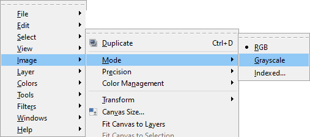
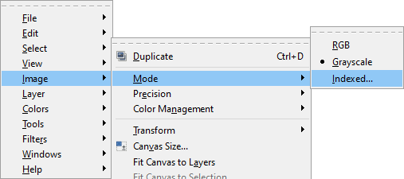
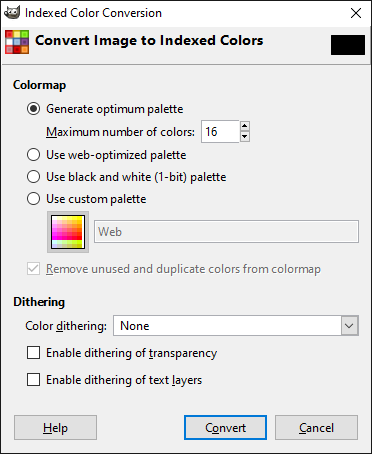
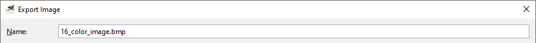
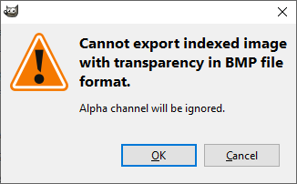
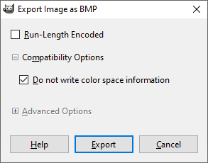

# Gimp Image Tutorial

1. Crop and/or resize the desired image to 64 x 128 px.

2. Set the image to grayscale.

3. Set the image to indexed.

4. Set the indexed settings to use 16 color. Setting dithering to `None` is also recommended but not required.

5. Export the image using the `.bmp` extension.

If you get this warning you can press `OK` and proceed with exporting.

6. Change the export settings to `Do not write color space information`.

7. Click `Export`.